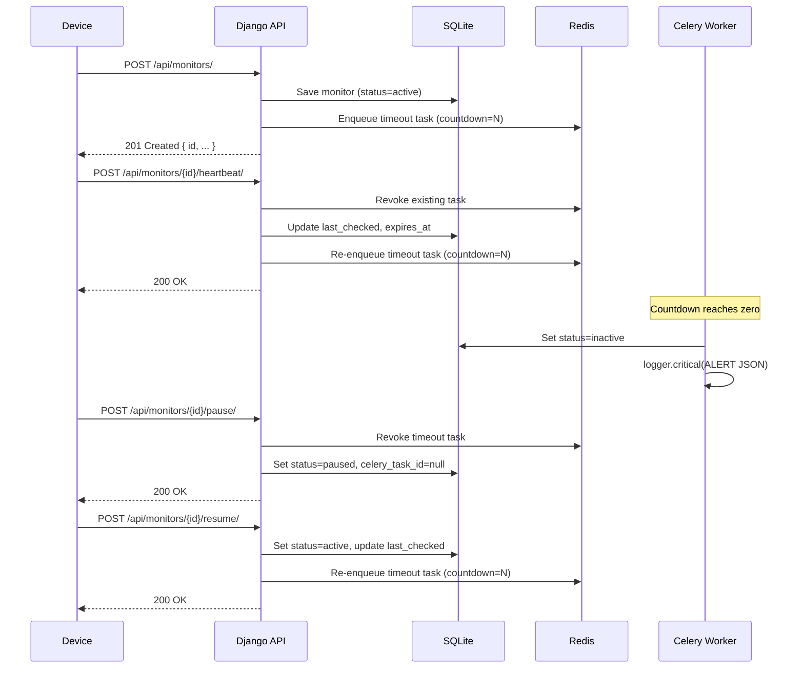

# Pulse Check API

A backend service for managing stateful dead man's switch timers. Clients register a monitor with a timeout, send periodic heartbeats to reset the countdown, and receive a critical alert if the timer ever reaches zero.

---

## Architecture Diagram



**Stack:**

- **Django + Django REST Framework** — API layer
- **Celery** — distributed task queue for timer management
- **Redis** — Celery broker
- **SQLite** — persistence (dev/local)

---

## Setup Instructions

### Prerequisites

- Docker and Docker Compose

### Run

```bash
git clone <repo-url>
cd Pulse-Check-API/Watchdog
docker compose up --build
```

This starts three services:
| Service | Port | Description |
|---|---|---|
| `web` | `8000` | Django API server |
| `worker` | — | Celery worker |
| `redis` | `6379` | Message broker |

The API is available at `http://localhost:8000/api/`.

### Environment Variables

| Variable     | Default (docker-compose) | Description       |
| ------------ | ------------------------ | ----------------- |
| `SECRET_KEY` | `local-dev-secret-key`   | Django secret key |
| `DEBUG`      | `True`                   | Enable debug mode |
| `REDIS_URL`  | `redis://redis:6379/0`   | Celery broker URL |

---

## API Documentation

All endpoints are prefixed with `/api/`.

---

### `GET /monitors/`

List all monitors, ordered by creation date (newest first).

**Response `200 OK`**

```json
[
  {
    "id": "my-service",
    "timeout": 60,
    "alert_email": "ops@example.com",
    "status": "active",
    "seconds_remaining": 42,
    "last_heartbeat": "2026-05-04T12:00:00Z",
    "expires_at": "2026-05-04T12:01:00Z",
    "created_at": "2026-05-04T11:59:00Z"
  }
]
```

---

### `POST /monitors/`

Register a new monitor and start the countdown.

**Request body**

```json
{
  "id": "my-service",
  "timeout": 60,
  "alert_email": "ops@example.com"
}
```

| Field         | Type    | Description                            |
| ------------- | ------- | -------------------------------------- |
| `id`          | string  | Unique identifier for this monitor     |
| `timeout`     | integer | Countdown duration in seconds          |
| `alert_email` | string  | Email address to associate with alerts |

**Response `201 Created`**

```json
{ "message": "Monitor 'my-service' registered.", "id": "my-service" }
```

---

### `GET /monitors/{id}/`

Retrieve the current state of a monitor.

**Response `200 OK`** — same shape as the list item above.

**Response `404 Not Found`**

```json
{ "error": "Not found." }
```

---

### `POST /monitors/{id}/heartbeat/`

Reset the countdown. Call this before the timer reaches zero to prevent the alert from firing.

**Response `200 OK`**

```json
{ "message": "Heartbeat received. Timer reset to 60s." }
```

**Response `404 Not Found`** — monitor does not exist.

**Response `409 Conflict`** — monitor is `inactive` (timed out); must re-register.

---

### `POST /monitors/{id}/pause/`

Suspend the countdown. The Celery task is revoked and no alert will fire while paused.

**Response `200 OK`**

```json
{ "message": "Monitor 'my-service' paused. No alerts will fire." }
```

**Response `404 Not Found`** — monitor does not exist.

---

### `POST /monitors/{id}/resume/`

Resume a paused monitor. Restarts the countdown from the full `timeout` duration.

**Response `200 OK`**

```json
{ "message": "Monitor 'my-service' resumed. Timer reset to 60s." }
```

**Response `404 Not Found`** — monitor does not exist.

**Response `409 Conflict`** — monitor is not currently paused.

---

### Monitor Status Values

| Status     | Meaning                             |
| ---------- | ----------------------------------- |
| `active`   | Timer is running                    |
| `paused`   | Timer suspended; no alert will fire |
| `inactive` | Timer expired; alert was fired      |

---

## Developer's Choice: Resume Endpoint

**What was missing:** The original design included a `pause` action but no corresponding `resume`. This made `paused` a one-way state — the only way to reactivate a paused monitor was to re-register it with a new ID, losing its history and breaking continuity for the client.

**What was added:** `POST /api/monitors/{id}/resume/`

- Only transitions a monitor from `paused → active`. Calling it on an `active` or `inactive` monitor returns `409 Conflict` with a clear error message.
- Resets `last_checked` to now and re-schedules the Celery countdown using the original `timeout` value — no reconfiguration required.
- Completes the pause/resume lifecycle: a monitor can be suspended for planned maintenance and brought back online without losing its identity or configuration.
