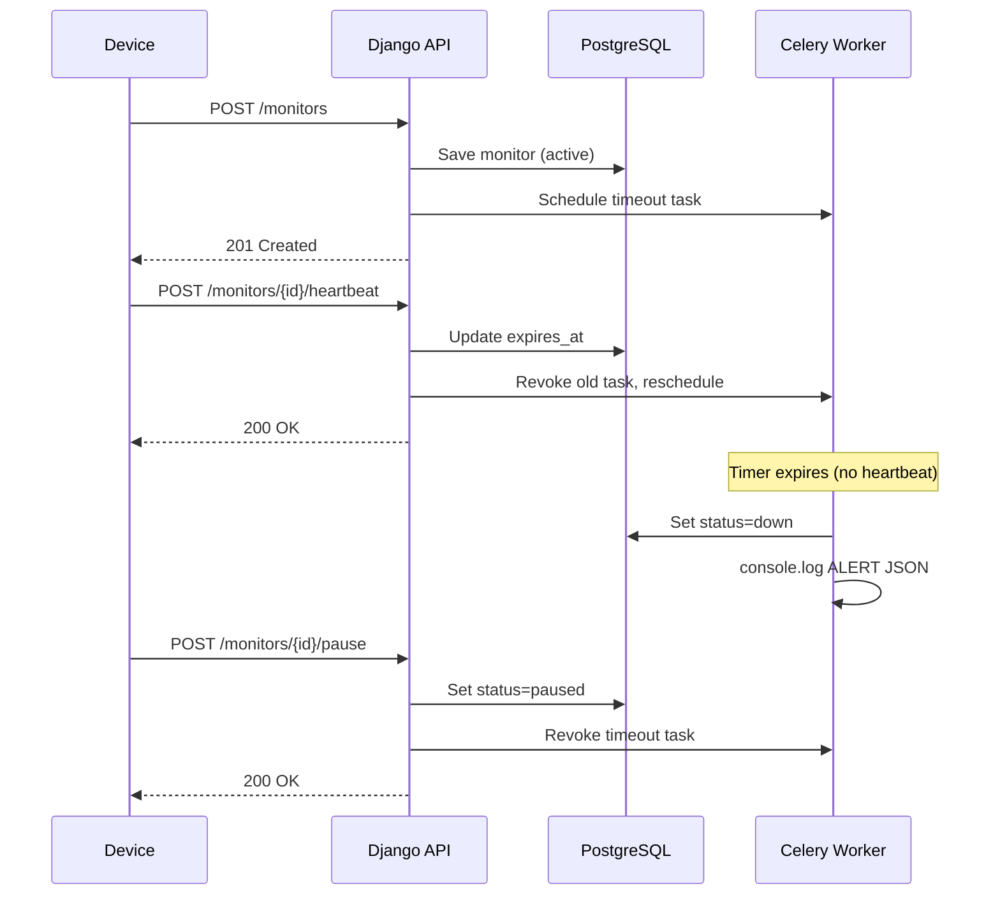

```mermaid
sequenceDiagram
    participant D as Device
    participant A as Django API
    participant DB as PostgreSQL
    participant C as Celery Worker

    D->>A: POST /monitors
    A->>DB: Save monitor (active)
    A->>C: Schedule timeout task
    A-->>D: 201 Created

    D->>A: POST /monitors/{id}/heartbeat
    A->>DB: Update expires_at
    A->>C: Revoke old task, reschedule
    A-->>D: 200 OK

    Note over C: Timer expires (no heartbeat)
    C->>DB: Set status=down
    C->>C: console.log ALERT JSON

    D->>A: POST /monitors/{id}/pause
    A->>DB: Set status=paused
    A->>C: Revoke timeout task
    A-->>D: 200 OK
```
